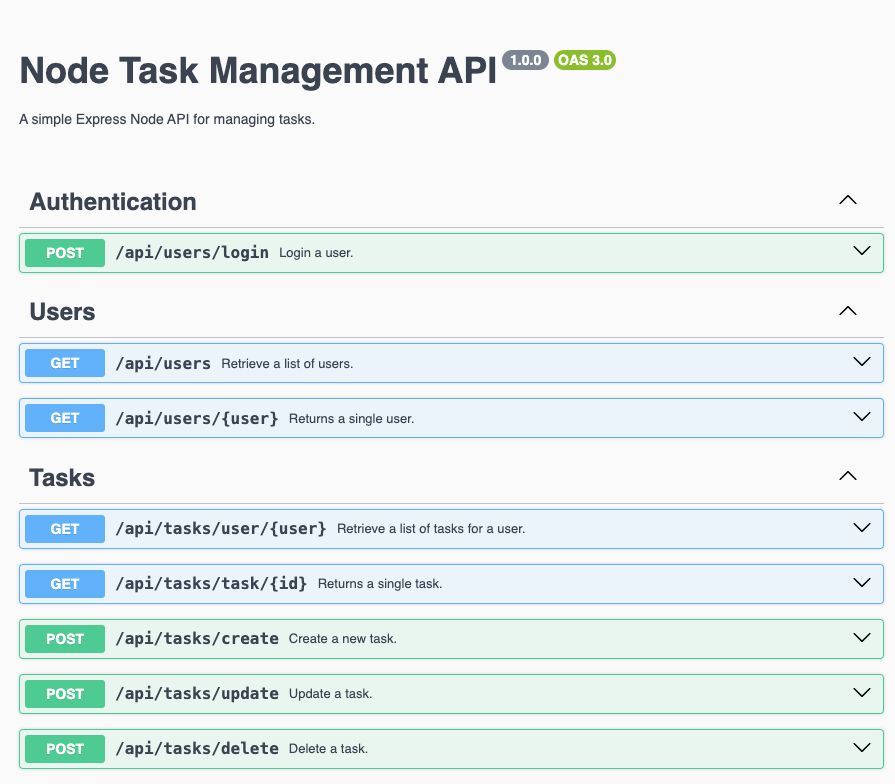

# Node Task Management API (node-task-api)

I am happy to announce the deployment of my node-task-api. This is a simple Express Node API for managing tasks. The app has been deployed to app.serverless.com.

This app is my first attempt at building a Node Express rest API. The API is fully functional. App data is persisted to and queried from MongoDB ATLAS. Having created the API, I intend to use it as a basis for a new series of articles, and serve as a resource for my current Angular and React tutorials.
